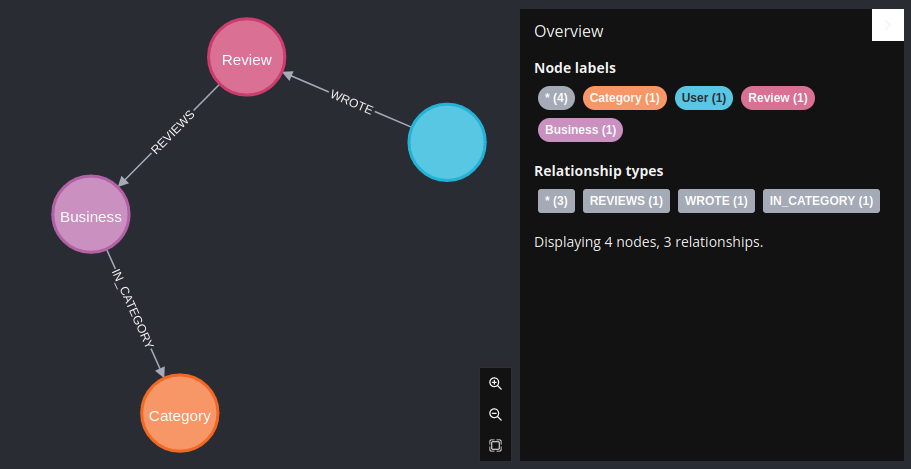
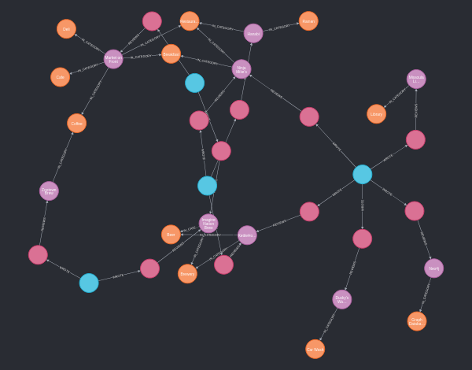

# TLDR

## Links

- [http://localhost:5000/graphql](http://localhost:5000/graphql)

## Init DB | Works with local docker Stack and with Bitnami /srv/docker

> local docker-compose require to `apoc-4.4.0.1-all.jar` copy to `volumes/neo4j/plugins/

book page 71

```cypher
MATCH (n) DETACH DELETE n;

:play grandstack
Added 36 labels, created 36 nodes, set 121 properties, created 41 relationships, completed after 4188 ms.

// now create stuff from init.cypher

// Display constraints and indexes
:schema

CALL db.schema.visualization();

MATCH (n) RETURN n;
```





## Fix Neo.ClientError.Statement.ExternalResourceFailed

occurs when try seed database with `:play grandstack`, and try to load csv from a external url resource

- [Neo.ClientError.Statement.ExternalResourceFailed](https://stackoverflow.com/questions/56573653/neo-clienterror-statement-externalresourcefailed)

or read notes at **Neo4j - How To**